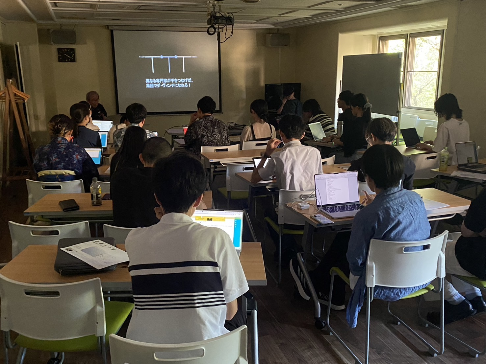

# KSK432 — Kosuke Shimizu

This repository contains the sources for the KSK432 personal website. The root
`index.html` now acts as a language selector. The full English site with the
terminal interface lives under `en/`, while Japanese pages are placed under
`ja/`.

[ターミナルを開く](https://ksk432.com/en/index.html) ·
[日本語プロフィール](https://ksk432.com/ja/summary.html) ·
[English profile](https://ksk432.com/en/summary.html) ·
[作品一覧](https://ksk432.com/en/works.html) ·
[論文一覧](https://ksk432.com/en/publications.html) ·
[ブログ](https://ksk432.com/blog/)

## このサイトで読めること

清水紘輔（Kosuke Shimizu）の研究・制作・活動をまとめたポートフォリオです。
筑波大学で HCI・メディア技術・数理モデリングを軸に、身体・記憶・現実感をめぐる
インターフェースを研究・制作しています。プロフィールでは、経歴やスキルに加えて、
次の3つの研究テーマと、体験を観測・モデル化してインターフェースへ落とし込む研究姿勢を紹介しています。

- **体性感覚刺激インターフェース**：身体への刺激を通じて、現実感が生まれる条件を探る。
- **記憶と再接続する環境**：過去の思い出を呼び起こす手がかりを、日常の環境やインターフェースに組み込む。
- **能力を拡張する計算機システム**：AIや人間拡張技術によって、人の特性を生かしながら目標達成を支える。

[プロフィール・研究ビジョンを読む](https://ksk432.com/ja/summary.html)

### 研究・論文

| 研究 | 内容と、リンク先で読めるもの |
| --- | --- |
| [語彙学習を支援するバイノーラル音響](https://ksk432.com/research/binauralaudio/) | 英単語の意味を表す音を空間的に提示し、語彙の記憶を支援する研究。40語の音刺激を用い、高校生20名がバイノーラル・モノラルの両条件で学習する実験を紹介しています。研究ページには方法・結果・考察、5種類のデモ音源、論文PDFがあります。 |
| [Floating Captions（ETRA 2025）](https://dl.acm.org/doi/10.1145/3715669.3726816) | 視線追跡を用い、没入型VRコンテンツの文脈に応じて字幕を提示するシステム。リンク先は論文の掲載ページです。 |
| [Visceral Resonance（Augmented Humans 2026）](https://doi.org/10.1145/3795011.3797423) | 音声の強調に同期した電気的筋刺激によって、音声を聴く体験を拡張する研究。リンク先からデモ論文の書誌情報を確認できます。 |
| [Detecting Cross-Area Concept Links in HCI Using Persistent Homology（CHI EA 2026）](https://doi.org/10.1145/3772363.3798751) | パーシステントホモロジーを使って、HCIの異なる領域をまたぐ概念のつながりを検出する研究。リンク先は論文の掲載ページです。 |

バイノーラル音響を試すには、研究ページのプレーヤー、または
[grotto.wav](https://ksk432.com/research/binauralaudio/audio/grotto.wav)・
[whirl.wav](https://ksk432.com/research/binauralaudio/audio/whirl.wav)を開いてください。
ヘッドホンでの試聴を推奨しています。
[研究ページ掲載のPDF](https://ksk432.com/research/binauralaudio/paper/compiled/hissympset_overleaf_utf-5.pdf)と
[学会誌論文のDOI](https://doi.org/10.11184/his.27.4_249)から本文や掲載情報へ進めます。

[論文一覧](https://ksk432.com/en/publications.html)には、学術誌論文・国際会議・国内発表などを掲載しています。
視線とVR鑑賞、音声、妖怪のデジタルアーカイブ、感情表現などの研究もたどれます。
掲載予定の論文には **Forthcoming** と記載しています。

### 作品・展示・活動

[作品一覧（Works）](https://ksk432.com/en/works.html)では、各作品の紹介に加え、
掲載されている画像・プロジェクトサイト・活動報告・映像から制作の詳細を見られます。

| 作品・活動 | 内容 |
| --- | --- |
| MetaPuppet | 自分のライブカメラ映像をVR空間に取り込み、自分の身体をマリオネットのように操作する体験。Anji Fujiwaraとの共同制作。 |
| Project Bakebake | 妖怪を題材に、AI・XR・デジタルアーカイブを組み合わせるインタラクティブなストーリーテリング。 |
| Wind Garden | 吊り下げた面や糸の揺れ、動き出すまでの間、静止へ戻る過程を通じて、室内に入る風を感じるインスタレーション。 |
| MEETME | 自分の姿と声から生成された分身のビデオメッセージを通じて、自己理解を探る作品。阿曽祥大との共同制作で、ニコニコ超会議2024に出展。 |
| Song of Akabane Whale | 赤羽で集めた環境音を、都市にいる架空のクジラの声として捉え、音と映像に展開する活動。 |
| Mirai no Heiwa Katsudo-ten in Nagasaki | 歴史理解と自己との関わりを扱う展示・研究。長崎の原爆映像の鑑賞と顔のモーフィングを扱うADADA 2025の論文につながります。 |
| The Music of the Sphere | 宇宙への想像力を背景に、メディア表現と体験の構成を探る制作活動。 |
| Let's Pray / Play for Peace 2026 | 観客が参加するリアルタイム映像を用いたチャリティーコンサートのバックエンド・インフラ支援。WorksからYouTubeのアーカイブを視聴できます。 |
| Studemia | 学生・大学院生が分野を越えて学ぶコミュニティ。合宿、ゲスト講演、読書、議論を行い、代表理事として活動しています。 |

#### Studemiaの活動風景

[](https://studemia.org/)

[Studemia公式サイト](https://studemia.org/) · [Worksで紹介を読む](https://ksk432.com/en/works.html#studemia) · [写真の掲載元](https://pbs.twimg.com/media/GU0276CaIAAu1yg?format=jpg&name=large)

### ブログ・研究についての考え

[「VR学会が30年を迎えた今、感じること」](https://ksk432.com/blog/vr-society-30-years.html)
（2026年9月8日）は、個々の実験結果を、より一般的な人間理解や次の設計へどうつなげるかを考えるエッセイです。
身体・視点・環境の関係を組み替えるVRの可能性や、内受容感覚をめぐる問いを扱っています。
研究や制作の背景にある問題意識は、[ブログ一覧](https://ksk432.com/blog/)から読めます。

## ターミナルの使い方

このサイトでは、コマンドを入力しながらプロフィールや研究を探索できます。
[ターミナル](https://ksk432.com/en/index.html)を開き、起動演出が終わったら、
画面下の `>` の横に入力して **Enter** を押してください。
以下はブラウザ内のターミナルで使うコマンドです。

まずは、次のコマンドを1行ずつ試してみてください。

```text
help
ls
cd profile
cat contact.txt
cd ..
cd projects
ls
cd binauralaudio
```

`cd profile` でプロフィールを表示し、`cat contact.txt` で連絡先を読めます。
続いて `projects` に移動し、`cd binauralaudio` を実行すると、
[語彙学習を支援するバイノーラル音響の研究紹介](https://ksk432.com/research/binauralaudio/)が
別タブで開きます。研究の概要・デモ音源・論文PDFまでたどれます。
別タブが開かない場合は、ターミナルに表示されたリンクをクリックしてください。

### 読みたいコンテンツから探す

表のコマンドは左から順に、1つずつ実行してください。最初の `cd ~` で
ルートに戻るので、どのディレクトリからでも同じ手順で始められます。
右端のリンクから直接コンテンツを開くこともできます。

| 読みたいもの | ターミナルでの操作 | 直接開く |
| --- | --- | --- |
| プロフィール・研究関心 | `cd ~` → `cd profile` | [日本語](https://ksk432.com/ja/summary.html) / [English](https://ksk432.com/en/summary.html) |
| バイノーラル音響による語彙学習 | `cd ~` → `cd projects` → `cd binauralaudio` | [研究紹介・デモ音源・論文](https://ksk432.com/research/binauralaudio/) |
| Floating Captions（ETRA 2025） | `cd ~` → `cd projects` → `cd floating-captions` | [論文（ACM DOI）](https://dl.acm.org/doi/10.1145/3715669.3726816) |
| 論文・発表業績 | `cd ~` → `cd publications` → 表示内の **Full publications list** をクリック | [論文一覧](https://ksk432.com/en/publications.html) |
| エッセイ・研究ノート | `cd ~` → `cd blog` → **Open the blog →** をクリック | [ブログ一覧](https://ksk432.com/blog/) / [「VR学会が30年を迎えた今、感じること」](https://ksk432.com/blog/vr-society-30-years.html) |

制作・展示については、[作品一覧（Works）](https://ksk432.com/en/works.html)から
MetaPuppet、Project Bakebake、Wind Garden などの紹介へ進めます。

### 基本操作

| コマンド・キー | 動作 |
| --- | --- |
| `help` | 主なコマンドを表示 |
| `ls` / `ls -la` | 現在のディレクトリの一覧 / 隠し項目を含む詳細一覧を表示 |
| `cd 名前` | ディレクトリに移動して内容を表示。階層は1つずつ移動 |
| `cd ..` / `cd ~` | 1階層上 / ルートに戻る |
| `pwd` | 現在の場所を表示 |
| `cat contact.txt` | 連絡先を表示 |
| `cat list.bib` | Floating Captions の BibTeX レコードを表示 |
| `tree` | 公開ディレクトリとその中の項目をツリー表示 |
| `history` | このセッションで入力したコマンドを表示 |
| `clear` | 出力を消去（現在の場所はそのまま） |
| `home` | ウェルカムメッセージを再表示 |
| **↑ / ↓** | 入力履歴を前後にたどる |
| **Tab** | `cd bina` などのディレクトリ名を、候補が1つのときに補完 |

### 外部サイトを開く

ブラウザ内で `open` と入力すると、登録済みのリンク名を確認できます。
次のコマンドはそれぞれ別タブを開きます。

| コマンド | リンク先 |
| --- | --- |
| `open yoyaku` | [予約カレンダー](https://calendar.app.google/9ByBTDMnoJqSTMrt5) |
| `open comtech` | [ComTech](http://ksk432.com/ComTech.github.io/) |
| `open mkomg` | [mkomg.lol](https://mkomg.lol) |
| `open shinitai` | [shinitai.shop](https://shinitai.shop) |

操作の実装とターミナルに表示するデータは [en/index.html](en/index.html) にあります。

## Running locally

For the JavaScript terminal to work properly, serve the files through a simple HTTP server. One option is Python's built-in server:

```bash
python3 -m http.server 8000
```

Then open `http://localhost:8000/en/index.html` in your browser. The page will show the loading messages and automatically switch to the terminal after the sequence completes.

## Repository contents

- `index.html` – language selector page
- `en/index.html` – English terminal interface
- `en/works.html` – works list (English)
- `en/summary.html` – English summary page
- `ja/summary.html` – Japanese introduction page
- `style.css` – common styles
- `script.js` – standalone script for lightbox functionality
- `blog/` – simple markdown-based blog framework

## Blog framework

The `blog/` directory contains a minimal system for writing posts in Markdown.
Add new posts in `blog/posts/` using the following front matter:

```markdown
---
title: My Post Title
date: 2025-01-01
---

Your content here.
```

Install `blog/requirements.txt`, then run `python3 blog/generate.py` to convert
Markdown files into HTML and update `blog/index.html`. The generated files are
committed so GitHub Pages serves them without a server or JavaScript build.

```bash
python3 -m pip install -r blog/requirements.txt
python3 blog/generate.py
```

The blog uses its own `blog/blog.css` for a responsive reading layout, an
automatically generated table of contents, reading-time estimates, and print
styles. Article dates are required (`YYYY-MM-DD`); the index lists the newest
articles first. Optional front matter includes `lang` (`ja` or `en`), `category`,
`tags` (comma-separated), `description`, `title_lines` (optional title breaks
separated by `|`; the parts must reproduce the title), `cover_mark`, `cover_caption`, and
`cover_note`. `unlisted: true` hides an entry from the index while keeping its
URL accessible; it is not a private draft. The original Hello World sample is
unlisted.

For a paper introduction, copy `blog/templates/research-note.md` into
`blog/posts/` with a new filename. Fill in `publication_title`,
`publication_venue`, and either `doi` or `publication_url` to display a paper
reference panel above the article. Keep the discussion in the Markdown body;
the template itself is not published. Images can live under `blog/images/` and
be referenced as ``.


## OS shell shortcuts (Bash / Zsh)

The commands above run inside the website. For shortcuts in your computer's
Bash or Zsh shell, source the hidden [.web_aliases](.web_aliases) file from your
shell configuration. These functions use `xdg-open` on Linux or `open` on macOS:

- `comtech` – opens <http://ksk432.com/ComTech.github.io/>
- `mkomg` – opens <https://mkomg.lol>
- `shinitai` – opens <https://shinitai.shop>

Add the following line to your `~/.bashrc` or `~/.zshrc`:

```bash
source /path/to/repo/.web_aliases
```

The file name begins with a dot so it will not appear in a plain `ls` listing.
